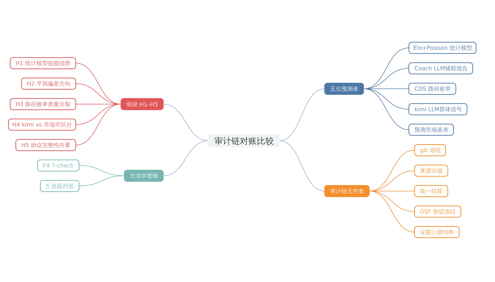
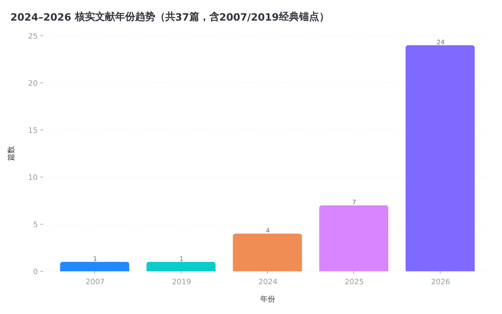
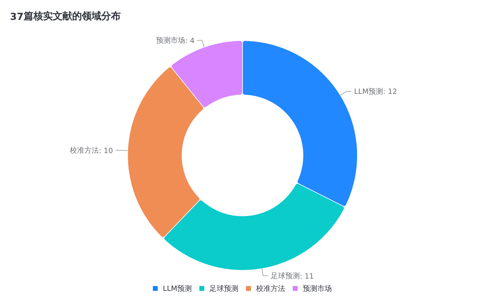
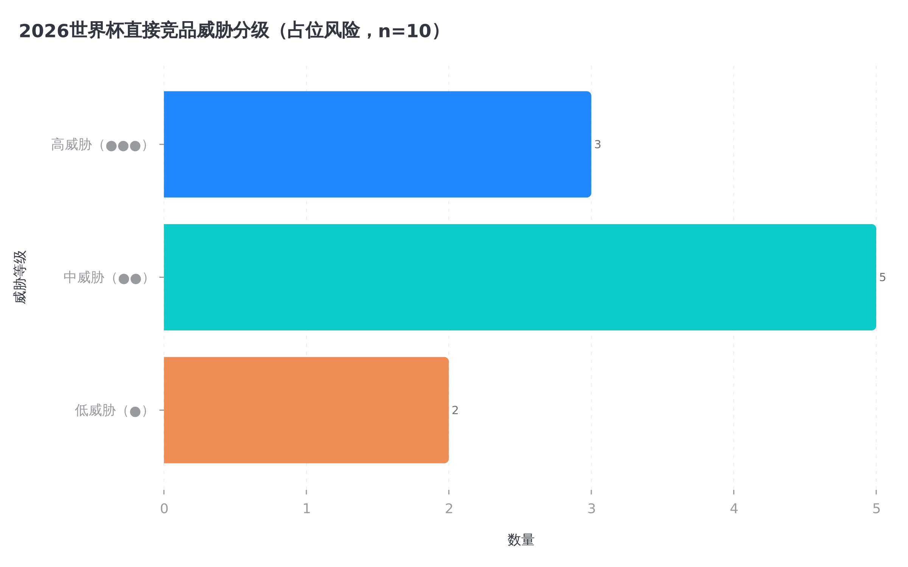
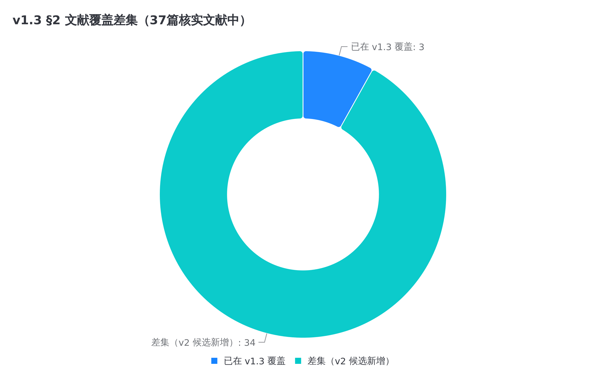

# 开题报告：同一审计链下的五类预测者——2026 世界杯预测方法的比较实证研究

> **Five Forecasters on One Audit Trail: A Pre-registered Comparative Study of Statistical, Monte-Carlo, Path-Space, LLM-Crowd and Market Predictions at the 2026 FIFA World Cup**
> 版本：v2.0（四阶段流水线方法论重构：F4 7-check 逐项锚定 + §2 文献综述扩编 + H5 协议完整性向量 + 指标分解升级 + W6 诚实边界吸收）｜ 日期：2026-07-21
> 上游：v1.3（2026-07-20，原文件只读、未做任何修改）；重构依据：四阶段流水线 Stage 1–3 产出（`analysis/worldcup-proposal-review/`：stage1-review-report.md 五维审查与 27 条章节级建议；stage2-data-summary.md + stage2-literature-table.csv 37 篇 100% verified 文献底座；charts/ 5 张图）
> 方法论透镜：F4 7-check methodological-insight test + Nature 5 选题判据（`research/nature-first-class-paper/REPORT.md` 及 findings/F2–F4）；W6 终裁备忘录 §8 禁用表述清单（`docs/investigations/worldcup-paper-topic-2026-07-19.md`）
> **主线裁定（用户 2026-07-20）**：本开题为论文主线。平行存在的 W6 终裁备忘录降为参考；其 P2 定性复核（LLM 辅助混合）已被 v1.3 吸收，其"协议失败标签 / 协议完整性向量"概念在 v2.0 中升级为 H5 假设与 §9.5 创新点，仍不独立成线。
> 证据基础：`evidence/cds4worldcup-snapshot-2026-07-20/`（**证据快照**，含完整 git bundle 与工作区镜像，MANIFEST 校验通过）
> 命名约定：**封存仓库** = 原 `cds4worldcup`（HEAD `e8d74aa`，零读写）；**证据快照** = `auto-research/evidence/cds4worldcup-snapshot-2026-07-20/`（字节级原始，永不修改）；**分析副本** = `auto-research/analysis/worldcup-2026/`（待建，可写，增补逐条记 CHANGELOG）。本报告所有 `cds4worldcup` 内路径均指证据快照镜像，对应封存仓库公开 commit。
> 评审状态：待 R1（评审规则见附录 B，v2.0 起升级为 6 维 rubric）

---

## 摘要

本文提出 **audit-chain-anchored multi-forecaster reconciliation protocol（审计链锚定的多预测者对账协议）**：以 git 冻结、来源分级、统一结算管线、OSF 分析协议冻结与协议完整性向量（Protocol Integrity Vector, PIV）五件套，把多份来源异质、输出形式异质的事前预测升格为可复现的同台评估对象，并将协议完整性状态作为与预测分数并列的一等评估字段。协议被应用于一个已完成结算的天然实验场：2026 世界杯期间在封存仓库 `cds4worldcup` 中赛前冻结的五类预测——Elo+Poisson 统计模型（P1）、LLM 辅助混合预测器（P2）、CDS 路径空间枚举（P3）、kimi LLM 群体信号（P4）、Polymarket 市场快照（P5）。逐场层（n=72；P1 因协议瑕疵为 71）以预注册主指标 RPS + Brier 的 Murphy/Yates 分解（calibration vs discrimination 分量）+ reliability diagram 做统计检验；队伍层（赛事级 n=1）与市场时间线仅做描述。预期贡献是方法学的：(i) 一套可复用、可迁移至其他 evidence→factor→settlement 管线的对账协议；(ii) deviation-direction signature 框架下五类预测者的结构性偏差刻画（含硬选准确率与 proper score 的排名反转）；(iii) asymmetric-evidence-as-herding-diagnostic 框架下 LLM 群体信号与市场共识的可检验对照；(iv) PIV 七字段作为可继承的协议级评估对象。统一结算数据集与市场日度概率矩阵作为 cross-method deliverable 发布，不作为创新卖点。本文不产出投注建议、不报告收益率；kimi 信号的相关数字一律按 Red Source 处理并注明冻结版本。

---

## 第 0 章 导读：这份报告在做什么（给非专业读者，5 分钟版）

### 0.1 一句话和三个比喻

**一句话（方法学表述）**：我们提出 audit-chain-anchored multi-forecaster reconciliation protocol（审计链锚定的多预测者对账协议），把它应用到 2026 世界杯五类赛前冻结预测的同台比较上——用同一把结算尺子批改五份"考前答卷"，刻画不同预测方法"错的方式"有何系统性不同。

**为什么不寻常**：体育预测论文遍地都是，但几乎都是"赛后训练一个模型再回测"——研究者知道答案再出题。本研究的五份预测是赛前真实冻结、带公开 git 时间戳、连预测过程的项目治理记录都在的证据等级；更重要的是，本文的评估对象不是某一份预测，而是**评估协议本身**——预测分数与协议完整性状态并列报告。

**三个比喻**：

| 比喻 | 对应的概念 | 解释 |
|---|---|---|
| **封卷考试** | ex-ante 冻结 | 五份预测在开赛前提交「封存」，git 提交记录全程可审计。本文只是「阅卷」，不能再改答案 |
| **同一把尺子** | 统一结算管线 | 五种方法输出形式不同（逐场概率 / 夺冠概率 / 市场赔率），要先用统一规则换算到同一任务上再评分，防止「尺子偏袒某个考生」 |
| **错题本** | 校准结构分析（deviation-direction signature） | 不比谁分数高，而比「错的方式」：A 方法总是低估平局，B 方法总是把概率撒得太散——错题模式比总分更有信息量 |

### 0.2 五位「考生」是谁

| 考生 | 方法类型 | 考前答卷 | 已有批语（项目自评，须由我方管线复算） |
|---|---|---|---|
| P1 Elo+Poisson | 经典统计模型 | 72 场小组赛胜负平概率（无淘汰赛预测） | Brier 0.573（均匀基线 0.667），系统性低估平局 |
| P2 Coach 对位 | LLM 辅助混合预测器（LLM 选首发 XI + 身价对位 MC） | 72 场小组赛胜负平概率（无淘汰赛预测） | Brier 0.608，硬选命中率最高 59.7% |
| P3 CDS 路径空间 | Elo/Bradley-Terry 晋级路径枚举 | 48 队夺冠概率 | **结构性失误**：93.5% 概率质量压在出局队，头号热门塞内加尔 32 强出局 |
| P4 kimi 群体信号 | 300 个 LLM 分身 × 10 派别聚合 | 21 队夺冠概率（生成于赛前 2026-06-05，Red Source） | 前五热门中四队进四强——但项目自定级「只能参考」 |
| P5 市场快照 | Polymarket 每日赔率 | 45 队夺冠概率 × 38 天 | 未结算，是衡量其他人的「硬基准」 |

每位考生除预测分数外，还将携带一份**协议完整性向量（PIV）**标注（ex-ante 状态 / 快照状态 / 来源完整性 / prompt hash 状态 / schema 状态 / 裁决状态 / 基线覆盖 / 预注册状态，字段定义见 §3 H5 与 §5.5）——例如 P1 的快照状态为"commit 可恢复但工作区已漂移"，P4 的来源完整性受"Red Source 且经 Elo bonus 渗入 P1 代理"影响。分数与协议状态并列报告，是本协议区别于既有 benchmark 的核心设计。

### 0.3 这份报告怎么判断「算法优劣」

分三层，**只有第一层允许下统计结论**：

- **逐场层（n=72；P1 因协议瑕疵为 71）**：样本量支持统计检验。主指标预声明为 RPS；Brier 不作单一总分解读，而以 Murphy 分解（calibration vs discrimination）与 Yates 三项重排报告分量，并配 reliability diagram。两两比较用配对 bootstrap，多重比较做校正。注意：两位逐场考生都只交了小组赛的卷子——淘汰赛没有逐场预测可结算，这是证据快照核查确认的事实，不是选择。
- **队伍层（n=48，但赛事级 n=1）**：夺冠概率校准只有一届赛事可验证，**只做描述不做断言**。P3 的过度分散、P4 与市场的高度重合，都是描述性发现。
- **时间线层（38 天市场快照）**：描述市场预期的演化，作为背景参照。

### 0.4 报告结构与阅读路线

- 只想了解思路：读完第 0 章即可。
- 想知道凭什么说「这个比较在方法学上站得住」：读第 2 章（v2.0 大幅扩编，含与全部直接竞品的显式区分）。
- 想知道具体怎么比：读第 3–5 章（§3 新增 H5 协议完整性向量假设与 7-check 逐项锚定）。
- 关心有哪些坑：读第 7 章（风险与诚实边界，含 W6 禁用表述合规对照表）。

**研究框架总览（Visual Anchor）**：

**Data Contrast（框架分支 → 章节落点 → 关键数据锚）**：

| 框架分支 | 对应章节 | 关键数据锚 |
|---|---|---|
| 五位预测者（P1–P5） | §0.2 / §3 / §5.1 | 72(71) 场逐场概率、48 队夺冠概率、21 队 kimi 信号、45 队 × 38 天市场快照 |
| 统一结算管线（A1/A2） | §4 / §5.3 | RPS 主指标 + Brier 分解 + 配对 bootstrap + BH 校正 |
| 校准结构分析（A3/A4） | §3 H2–H4 / §4 | 平局偏差方向、质量分散度、赛前截面 Spearman ρ |
| 协议完整性向量（H5/PIV） | §3 H5 / §5.5 / §9.5 | 七字段标注、fail-loud 缺失处置、外部生存测试 |
| 诚实边界 | §7 / 附录 | FIFA 前四首次全部进四强基准率锚点（2026-07-20 Green Source 核验） |

**Integrated Analysis**：框架图揭示了本开题的双层结构——下层是五份冻结预测的"阅卷"工作（逐场层可推断、队伍层仅描述），上层是对"阅卷过程本身"的审计（PIV）。v1.3 的框架重心在下层，v2.0 的关键变化是把上层从隐性纪律升格为显性研究对象：快照漂移（odds.json 与 cds_qualification.json 均为 07-19 漂移版）、kimi 的 Red Source 渗入、factor-ledger 3.85% 覆盖率这些原本只在脚注里道歉的事项，在 v2.0 中都成为 PIV 字段的实证取值，与预测分数并列进入结算表。这一结构使本研究在"2026 世界杯预测"赛道拥挤（§2.6 占位风险分析）的情况下仍保有独立贡献：竞品交付的是预测集合或 leaderboard，本研究交付的是带协议完整性标注的已完成结算比较。

---

## 1. 研究背景与问题提出

### 1.1 背景

足球赛事预测是预测科学的经典试验场：结果明确、样本规整、存在博彩市场这个「强敌基准」。六十年来形成了三条方法谱系：统计模型（泊松进球模型及其 Dixon-Coles 修正）、机器学习（随机森林、梯度提升）、市场共识（赔率与预测市场）。近两年的新玩家是 LLM：单模型概率预测已逼近人类预测锦标赛水平，「LLM 群体」（多分身、多派别聚合）作为群体智慧的新形态开始出现。2024–2026 年文献重心的三年三迁——从"LLM 能否预测"到"动态无污染 live 基准"再到"结算层与训练侧校准"（§2.0 趋势分析）——使"评估协议本身"成为新的方法学前沿：评分规则分解（Murphy/Yates）、commit-reveal 冻结、协议类指标（Hartvég 的 SVS/THR）相继出现，但把协议完整性结构化为与预测分数并列的一等评估字段的工作，在联网核查范围内尚无同形先例（§2.6）。

2026 世界杯（48 队新赛制首届）期间，我们在封存仓库 `cds4worldcup` 中以「计算决策空间（CDS）」方法论运行了一个预测实验，并按项目治理纪律把五类方法的预测全部赛前冻结、公开可审计。这批资产为上述方法学问题提供了一个已完成结算的应用场景：五类方法在事前信息完全相同、冻结纪律完全一致的条件下同台，其结构性差异可以被同一套对账协议干净地刻画。

### 1.2 问题提出

**总研究问题**：audit-chain-anchored multi-forecaster reconciliation protocol 如何在不同信息源、不同校准结构、不同归一化口径之间捕获预测者的结构差异签名？具体地：在完全相同的事前信息与公开可审计的冻结纪律下，五类预测方法在逐场与队伍两个层级上的概率结构（校准度、区分度、质量分布）存在怎样的系统性差异？这些差异中哪些可由协议完整性状态（而非预测能力本身）解释？

三个必须正面处理的障碍：

1. **层级间样本量不对称**。逐场层 n=72（P1 为 71，见 5.2 R1 处置）支持推断；队伍层赛事级 n=1 只支持描述。混淆这两层是体育预测论文最常见的统计错误，本课题以「分层声明」显式切割（第 5.5 节预注册），并以 PIV 的 baseline_coverage 字段强制逐任务报告分母。
2. **市场基准的规格错配**。市场快照是夺冠 outright 赔率（队伍级），无逐场胜负平报价——市场只能进入队伍层对照，不能做逐场映射反推。装作能做是方法学造假。同池重归一化（在 kimi 21 队与市场 39 队的交集上重新归一）作为协议字段显式定义，不是事后统计技巧（呼应 W6 终裁备忘录 §1.4「信号与归一化耦合」发现）。
3. **作者已见部分结果**。赛事已结束，72 场结算与 n=46 夺冠结算的数字作者已知。因此本文不做「预测预注册」（不可能），改做**分析协议冻结**（OSF，附已知/未知数字边界声明），防止评估口径被已知结果污染（第 5.5 节）。OSF 冻结物 = 指标定义、纳排标准、比较族、检验方法、分层声明、已知/未知数字边界声明、PIV 字段定义、同覆盖归一化规则、协议字段缺失的 fail-loud 处置规则、修订附录公开规则——该清单在 §0、§1.2、§5.5 三处一致。

### 1.3 意义

- **实证意义**：为「LLM 群体信号是否只是市场共识的复述」提供一条罕见的可检验证据——P4 与市场快照均赛前存在，可截面对照；v2.0 将该问题升级为 InfoDelphi 框架下的 asymmetric evidence 诊断（§3 H4）。
- **方法意义**：audit-chain-anchored reconciliation 协议把 git 冻结 + 来源分级 + 统一结算 + OSF 分析协议冻结 + PIV 五件套升格为可复现评估协议，回应预测评估文献中反复出现的 ex-ante 有效性争议。
- **跨子领域意义**：该协议的适用范围不限于体育预测——任何 evidence→factor→settlement 结构的管线（保险索赔审计、法律证据链、医学诊断复核）都可套用同一套字段定义与 fail-loud 处置规则；F4 7-check 的 Check 5（跨子领域可迁移性）锚定见 §3。
- **诚实边界**：本文不产出投注建议，不报告收益率；P4 的「前五中四」不作为技能证据（见 7.1 基准率论证）。

## 2. 文献综述

### 2.0 综述方法与证据底座

本节文献底座由四阶段流水线 Stage 2 提供：37 篇条目全部经联网核实（verified 37/37 = 100%；arXiv API 批量核验、GitHub API commit 时间线、Preprints.org 全文抓取、出版商页面；详见 `analysis/worldcup-proposal-review/stage2-literature-table.csv` 与 stage2-data-summary.md），覆盖 LLM 预测（12）、足球预测（11）、校准方法（10）、预测市场（4）四个谱系。v1.3 §2 的 13 条引用与该底座的交集仅 3 条（Gneiting-Raftery 2007、Halawi 2024、Prophet Arena 2025）——差集 34 条是本次扩编的对象。

**Visual Anchor（文献趋势）**：

**Data Contrast（年份—数量序列，Stage 2 数据块 D1）**：

| 年份 | 条数 | 阶段定性（Stage 2 归纳） |
|---|---:|---|
| 2007 | 1 | 经典锚点（proper scoring rules） |
| 2019 | 1 | 足球 ex-ante 挑战先例（Dubitzky） |
| 2024 | 4 | "LLM 能否预测"（Halawi NeurIPS 2024） |
| 2025 | 7 | "动态无污染 live 基准"（ForecastBench、Prophet Arena） |
| 2026 | 24 | "结算层与训练侧"（Polymarket-v1、Foresight Arena、RL 校准训练） |

**Integrated Analysis**：趋势图的指数化不只是数量现象，它标定了本研究的时间窗口。2024 年的问题（LLM 能不能预测）已被 Halawi 等人回答；2025 年的问题（如何无污染地持续评估）已被 ForecastBench/Prophet Arena 占据；2026 年的前沿已移到结算层质量（Polymarket-v1 的 ground-truth microstructure）、冻结协议（Foresight Arena 的 commit-reveal）与训练侧校准（Brier-as-reward）。本研究若仍以"我们也做了世界杯预测"入场，落在 2024 年的问题上；只有把评估对象升格为协议完整性本身，才落在 2026 年的问题前沿上。这是 §2.6 定位陈述与 §9 创新点全部以方法学机制名词为主语的文献依据。

**Visual Anchor（谱系结构）**：

**Data Contrast（domain 分布，Stage 2 数据块 D2）**：

| 谱系 | 条数 | 其中高相关 | 本研究对应位置 |
|---|---:|---:|---|
| LLM 预测 | 12 | 6 | §2.5（P2/P4 的对照设计） |
| 足球预测 | 11 | 6 | §2.1 / §2.2（P1/P2/P3 的谱系归属） |
| 校准方法 | 10 | 3 | §2.3 / §5.3（指标分解升级） |
| 预测市场 | 4 | 2 | §2.4（P5 的基准定位） |

**Integrated Analysis**：四谱系的分布解释了 v1.3 §2 的结构性盲区：v1.3 在"校准方法"谱系只有 2007/2012 两条经典文献，完全错过了 2026 年的评分规则方法学复兴（Yates 重排、Murphy 分解实证、Brier Index 更新）——而该谱系恰是本研究指标设计（§5.3）的直接理论来源。扩编后各谱系均有 2024–2026 年锚点，其中高相关条目（15 条）全部进入正文引用。方法关键词的长尾分布（Stage 2 数据块 D5：Brier 8 次、其余 60+ 关键词各 1–2 次）本身说明该领域方法碎片化，以"协议/结算"维度做收敛叙事具有真实的组织价值。

### 2.1 足球预测的统计模型谱系

泊松进球模型自 Maher（1982）奠基，Dixon & Coles（1997, *JRSS A*）引入低比分相关性修正与时间衰减权重，成为基线范式；其已知缺陷——独立进球假设下平局概率系统性偏低——正是本研究 P1 模型的预注册观察点（H2）。Elo 评级及其 Bradley-Terry 形式化是另一条经典线，本研究的 P1/P3 均以代理 Elo 为强度输入，需在 related work 中声明其与官方 Elo/FIFA 排名的代理差距。

ex-ante 纪律在足球预测中并非没有先例：Dubitzky et al.（2019, *Machine Learning*）的 Open International Soccer Database 支撑了 2017 Soccer Prediction Challenge，要求参赛者在结果未知时提交 206 场未来比赛的概率预测并以 RPS 评分——本研究的 RPS 主指标选择与之直接相承。Bunker, Yeung & Fujii（2024）的综述确认 Brier/RPS 已是足球预测评估的事实标准。最近邻的同届统计路线是 Rezaei & Samadi（2026）以 2018/2022 世界杯 128 场做 information-barrier 回测的 SDR-Elo——回测路线与本研究的赛前冻结路线互补，不构成占位（Stage 2 占位评级：中）。

### 2.2 机器学习谱系

随机森林与梯度提升在近三届世界杯预测中成为主流（Groll et al., *JQAS* 2019 的混合随机森林；Hubáček et al., *Machine Learning* 2019 的关系数据梯度提升）。该谱系的共同弱点与本研究直接相关：**多数工作为赛后回测，ex-ante 冻结罕见**；且以博彩赔率为基准时增量微弱。本研究的 P2 准确定性为 **LLM 辅助混合预测器**（2026-07-19 终裁备忘录复核：流水线为 LLM 选择 48 队 × 6 阵型的首发 XI，随后身价位置对位 + 20 次阵型蒙特卡洛 + Poisson 产生 W/D/L 概率），不是端到端纯 LLM forecaster——该定性直接影响 2.5 的 LLM 对照设计（P2 与 P4 都含 LLM 成分，但 LLM 介入环节不同：选阵 vs 群体投票），related work 须如实表述。

### 2.3 概率预测评估与适当评分规则

Gneiting & Raftery（2007, *JASA*）确立适当评分规则（proper scoring rules）框架：Brier、Log Loss 与多类结果的 RPS 是本研究的度量基础；Waghmare et al.（2025）的最新综述系统化了该框架的刻画与族系。Constantinou & Fenton（*JQAS* 2012）指出足球预测评估中评分规则选择不当的普遍性问题，支持本研究预声明主指标（RPS）+ 辅助指标的纪律。

2026 年该谱系出现明确的方法学复兴信号，本研究的指标设计直接受益：(i) Vieira（2026）把 Yates 协方差分解重排为三个非负项（方差失配 / 相关赤字 / 大样本校准），是当前最新的 Brier 分解理论；(ii) Nechepurenko et al.（2026）在 live 预测市场上实证应用 Murphy 分解，证明聚合 Brier 相同的系统在 calibration 与 discrimination 分量上可有截然不同的签名——"单一总分 → 分解诊断"是本研究 §5.3 指标升级的直接范本；(iii) Keogh & van Geloven（*Epidemiology* 2024）以 IPW 构造反事实验证集，把 Brier 扩展到反事实表现评估，是 replay/反事实评估方法论的最近先例（跨域借用已声明：因果医学预测，非体育结算）。预测锦标赛文献（Tetlock 2005；Mellers et al., *PNAS* 2014）提供了「技能 vs 运气」的分解框架与基准率意识——「热门队进四强」必须先过基准率检验才能谈技能（7.1）。

#### 2.3.1 "reconciliation" 的三重含义：显式区分

本协议名称中的 reconciliation 必须与技术文献中两个同形 false cognate 显式切开：

1. **Hyndman 传统的 forecast reconciliation**（如 Pinheiro, Bulhões, Hyndman & Rodrigues 2026 的多变量层级 reconciliation）= 层级/分组时间序列的 aggregation-coherence 调整，与预测结算无关；
2. **AIA Forecaster 的 supervisor reconciliation**（Alur et al. 2025）= 多 agent 对同一事件的输出调和，是预测生成阶段的组件；
3. **本文的 settlement reconciliation（结算对账）** = 把事前冻结的预测与事后结果在同一结算规则下对账，并审计对账过程本身的协议完整性。

三者共享的仅是对"一致性"的追求；本文的贡献域在第三者，且据 Stage 2 联网核查，"dual ledger reconciliation calibration""Brier score replay settlement"等组合术语在 arXiv 语料零命中（F3 §Findings[8]）。

### 2.4 预测市场与群体智慧

Wolfers & Zitzewitz（2004, *J. Economic Perspectives*）确立预测市场作为强基准的地位；体育博彩市场效率研究表明赔率接近无套利校准，超越市场极难。2026 年该谱系的重心转向结算层与评估协议：Polymarket-v1 数据库（Qin 2026）从链上结算层构建完整交易档案，证明 ground-truth microstructure 质量以分类代理无法恢复的方式预测 Brier 表现——是"结算层质量 → 评估可信度"论点的最近邻支撑；Foresight Arena（Nechepurenko & Shuvalov 2026）以 commit-reveal 协议构建链上 AI 预测基准，其 power analysis（区分 α*=0.02 需约 350 个已结算预测）为本研究 n=72 推断力的诚实边界提供文献锚点；Hindcast（Ye et al. 2026）与 PolyBench（Cheng et al. 2026）代表"市场 replay 评估 LLM"的拥挤新方向；Bosse（2026）的自动问题生成与结算（resolution 准确率约 95%）提示结算自动化路线的既有占位。

通用 live 基准一侧，ForecastBench（Karger et al., ICLR 2025）与 Prophet Arena（Yang et al., ICLR 2026）已占据"动态无污染、Brier/ECE、LLM vs human/market"叙事——本研究是单赛事多方法结构差异研究，不与通用基准比规模，但其 Brier Index 与 Murphy 分解方法学为本研究指标设计的引证来源。群体智慧文献（Surowiecki 2004；Hong & Page, *PNAS* 2004）给出「多样独立判断聚合优于个体」的理论条件——其关键限定词「独立」正是本研究 H4 的检验焦点；Royal Society（2026）发表的 crowd-vs-LLM 比较发现的 accuracy–correlation effect 进一步提示：聚合准确性与其内部相关性结构耦合，不能只看总分。

### 2.5 LLM 预测与 LLM 群体

Halawi et al.（2024）证明单 LLM 概率预测可逼近人类预测锦标赛水平；Prophet Arena（2025/ICLR 2026）以预测市场实时结算构建 LLM 预测基准。LLM 群体/集成一侧，Schoenegger et al.（2024）的 Wisdom of the Silicon Crowd 证明 LLM ensemble 聚合可 rival 人群预测准确性——这是本研究 P4（300 分身 × 10 派别）最直接的先验。两条方法学线索直接升级本研究的假设设计：InfoDelphi（Li et al. 2026）以消融实验证明多 agent 预测 deliberation 仅在 agents 持有 asymmetric evidence 时改善校准，identical-evidence deliberation 即 herding——H4 由此从"是否可区分"升级为"何种 asymmetric evidence 缺位导致 herding"；AIA Forecaster（Alur et al. 2025）显示 LLM+market 集成可超越市场共识单独——H4 由此增加"同池重归一后 kimi+市场合并估计是否超越市场单独"的 sub-question。Jajal et al.（ICML 2026）在 merger-arbitrage 场景以后见之明引导的推理轨迹使 LLM 预测 Brier 低于市场隐含概率 24%——其方法论杠杆是监督设计而非模型规模，且其场景有专家上下文工程，不能外推为本研究任何方法的技能预期。Pal et al.（2025）的 action-belief gap 提示静态校准不足以预测动态一致性，支持本研究对校准结论的描述性纪律。训练侧校准新谱系（ConfTuner, NeurIPS 2025；Verifiable Rewards, Singh 2026；Mantic/Thinking Machines 2026 的 Brier-as-reward RL 路线）与本研究的评估侧问题互补，作为背景引用。

**2026 世界杯直接竞品**（Stage 2 全部核实，占位风险详表见 §2.6）：Hartvég et al.（Preprints.org 2026）比较 reasoning/web-augmentation/agentic/open-weight 条件并引入 SVS/THR 协议类指标，但其赛后评估在 v1（2026-07-10）中明确为 future work；AlDahoul et al.（SSRN 2026）研究 LLM 世界杯预测中的 consensus bias，与本研究 H4 同形——差异在于 H4 不问"LLM 是否有共识偏差"（描述性），而问赛前同日截面上群体信号与市场是否统计可区分，判定规则预注册；ModelBall/Gibbins（2026，作者自托管）声称 LLM 体育预测系统性过度自信，但无独立同行评审且 n=4 模型，只作 novelty threat 不作承重事实；WorldCupBench、worldcup-predictor-2026、AI World Cup 三个 GitHub artifact 的最后提交分别为 2026-06-12 / 06-30 / 06-11，截至 2026-07-21 无一发布赛后总结算；LMU LLM SoccerArena 为三校联合 live leaderboard，赛中每日更新，赛后论文为潜在高威胁。已有工作评估的是「一个 LLM 对一个问题的概率」或 leaderboard 排名；**多分身 × 多派别聚合的 LLM 群体信号与市场的同台 ex-ante 对照，且评估协议本身带完整性标注**，在我们核查范围内尚无先例。P4 的生成过程文档（执行计划、聚合公式、时间戳）已在证据快照中寻回（5.1），残余局限为底座模型版本不可考（7.5）。

### 2.6 定位陈述与占位风险

综合 2.1–2.5，本研究的落点不是"又一个世界杯预测 benchmark"，而是：**audit-chain-anchored reconciliation 协议 + 协议完整性向量作为一等评估字段**在最接近的 prior art 之外的可证伪空白。具体地：Dubitzky（2019）有 ex-ante 提交但无协议审计粒度；ForecastBench/Prophet Arena 有 live 无污染评估但无单赛事多方法结构差异刻画；Polymarket-v1/Foresight Arena 触及结算层质量但评估对象是链上交易或 agent 而非异质预测者集合；Hartvég 的 SVS/THR 是最接近的协议类指标，但只覆盖输出结构效度，不覆盖 ex-ante 有效性、快照漂移与来源渗漏。把协议完整性结构化为 benchmark 一等标注字段并与 proper score 联合发表的工作，在足球预测与通用 forecasting 文献中均未检出（Stage 2 负面结果记录在案）。

**Visual Anchor（占位风险）**：

**Data Contrast（直接竞品 crosswalk 摘要，Stage 2 数据块 D4 与占位风险表）**：

| 竞品 | 威胁 | 状态（2026-07-21 核实） | 本研究的差异化（一句话） |
|---|---|---|---|
| Hartvég et al. | ●●● | v1 2026-07-10，非同行评审，赛后评估为其 future work | 本文不是 LLM 世界杯 benchmark，而是同一审计链下五类异质方法（含统计/市场）的事后结算比较，协议完整性是一等评估轴 |
| LMU LLM SoccerArena | ●●● | 三校联合 live leaderboard，赛中每日更新 | 本文考生含非 LLM 方法与市场基准，全部预测赛前 git 冻结、评估协议 OSF 冻结——不是 leaderboard 而是对照实证 |
| AlDahoul et al. | ●●● | 预印本，主题=LLM 是否复述公众共识 | H4 判定规则预注册，且以 asymmetric evidence 诊断粒度提问，不做描述性共识偏差主张 |
| WorldCupBench | ●● | 2026-06-12 后停更，leaderboard 为空，无赛后结算 | 本文交付已完成结算 + 复算验证的比较实证，非冻结后未阅卷的预测集合 |
| ModelBall | ●● | 作者自托管 PDF，n=4 模型 | 本文不做"过度自信"全称主张，只做 reliability diagram 支持的分箱校准描述 |
| worldcup-predictor-2026 | ●● | 2026-06-30 停更，三臂设计完整但无赛后总评 | 本文差异在方法族异质性（五类考生）与审计链，不在单 LLM 多臂消融 |
| ai-world-cup | ● | 2026-06-11 停更 | 同上，且工程 artifact 非学术发表 |
| ForecastBench / Prophet Arena | ●● | 持续活跃，通用 live 基准 | 本文是单赛事多方法结构差异研究；其指标方法学为本文引证来源 |
| Foresight Arena | ●● | v2 2026-05-04，live 结果未发布 | 本文评估对象是预测者而非链上 agent；其 power analysis 反被本文引为小样本边界依据 |
| Polymarket-v1 / Hyndman / AIA | ● | 方法近邻，非同题 | 术语 disambiguation：结算对账 ≠ 层级时序 reconciliation ≠ agent 输出调和（§2.3.1） |

**Integrated Analysis**：占位风险图显示"2026 世界杯 LLM 预测"标题区已被实质占满——三个高威胁竞品分别占据 benchmark framing（Hartvég）、live leaderboard（LMU）与 H4 同形主题（AlDahoul）。本研究的可守红线因此只剩一条：**把协议破坏结构化为评估字段并与预测分数联合发布**。该红线目前可守（联网未检出同形先例），但窗口依赖两个易逝条件：(i) 三个 GitHub artifact 与 Hartvég 的赛后结算空窗——任何一家先发布带协议标注的结算，红线即告失守；(ii) LMU 赛后论文的发表节奏。这直接决定了 §8 的 8 周紧凑进度与 venue 四档设计（§8 W6 行）。同时必须承认：该 novelty 声明是"有限核查 + Stage 2 系统检索"级别的断言，投稿前须按 §6.2 缺口完成正式系统文献检索。

**与「宣布胜利」叙事的显式切割**：项目首页展示的 kimi 信号前五热门中四队进四强，不构成任何方法的技能证据——(i) 该信号项目自定级为 Red Source「只能参考」；(ii) 本届为世界杯史上首次 FIFA 排名前四球队全部进四强（2026-07-20 Wikipedia Green Source 核验），前五热门含四队进四强在本届基准率下并不罕见；(iii) 项目自身的 CDS 引擎（P3）在同届赛事出现结构性过度分散。本文的科学问题是结构差异与协议完整性，不是排名。

---

## 3. 研究问题与假设

**总问题**：见 1.2。**前置声明（F4 7-check 锚定）**：以下 H1–H5 不是五个并列的结果性预测，而是 audit-chain-anchored multi-forecaster reconciliation protocol 在五个诊断维度上的组件级假设——H1/H2 检验协议在逐场层的统计识别力，H3 检验协议对路径枚举引擎结构失败的解释力，H4 检验协议对 LLM 群体信号与市场共识关系的诊断粒度，H5 检验协议完整性向量（PIV）本身作为评估对象的诊断力。其中 H1/H2 在逐场层（n=72/71）做统计检验；H3 为队伍层描述性命题，不做优越性断言；H4 的溯源前置条件已基本满足（5.1），残余局限在 7.5 披露；H5 的外部生存测试为 stretch 目标，失败有预写降级路径。

### 3.0 F4 7-check 逐项锚定

- **Check 1（single-methodological-insight sentence）**：全文核心贡献可写为一句方法学句子——"我们提出 audit-chain-anchored multi-forecaster reconciliation protocol，以 git 冻结 + 来源分级 + 统一结算 + OSF 分析协议冻结 + 协议完整性向量五件套，把多源事前预测升格为可复现的同台评估对象，并将协议完整性状态作为与预测分数并列的一等评估字段。"主语是协议，不是"我们拥有五份独家预测"。摘要、§0.1、§1.2、§9.1 四处句式一致。
- **Check 2（移除数据独有生存）**：心理移除"2026 世界杯五份冻结预测"这一独占数据后，协议五件套、PIV 字段定义、fail-loud 处置规则、同覆盖归一化规则仍独立成立——它们可应用于任何带事前冻结纪律的预测比较（其他赛事、预测市场、专家小组）。数据集仅是协议的首个完整应用案例。
- **Check 3（评估性主张清晰度）**：每项主张挂三层限定——具体主张（H1–H5 各自的判定规则，预注册）、成立假设（分层声明：仅逐场层允许统计推断；配对 bootstrap 双侧 α=0.05 + BH 校正；Foresight Arena power analysis 提示 n=72 只能识别大效应）、约束条件（单届赛事、小组赛限定、作者已见部分结果的 OSF 边界声明）。
- **Check 4（知识缺口）**：缺口是方法学的——"多预测者事前冻结同台比较如何从一次性 benchmark 升级为协议级审计方法；协议完整性如何成为一等评估字段"——而非数据缺口（"没人采集过这类数据"）。§2.6 已证明任务、指标、benchmark 形态均被占位，唯协议审计粒度未被占据。
- **Check 5（跨子领域可迁移）**：协议与 PIV 可迁移至任何 evidence→factor→settlement 管线（保险索赔审计、法律证据链、医学诊断复核、其他体育赛事、预测市场结算）；方法学范式归属为 POMDP 式组件分解（belief → forecast → action → utility 逐组件独立校验）在预测评估场景的变体。
- **Check 6（deep-concern 抗冲击）**：即使 reviewer 提出最强反对——"单届赛事无外部效度""n=72 推断力不足""所有非市场方法都被市场碾压"——协议的独立生存不受影响：这些反对针对的是数据规模，而贡献主张是方法与评估协议；市场碾压非市场方法本身就是与文献一致的诚实结果（§7.4）。
- **Check 7（无 unique 数据可复现）**：协议五件套可在公开数据上重建（任何公开冻结预测 + 公开结算结果）；PIV 的外部生存测试（在 WorldCupBench / Prophet Arena / ForecastBench 公开 artifact 上盲标注）正是把 Check 7 变成实证检验的设计（§9.5）。

**分层声明（预注册）**：逐场级 n=72（72 场小组赛；**两位逐场考生均无淘汰赛预测**，证据快照核查确认 2026-07-20）可推断；队伍级 n=48 夺冠概率 = 单届赛事，仅描述；市场日度序列仅描述。

### 3.1 假设清单

- **H1（协议可识别逐场技能）**：在 audit-chain 协议的逐场层结算下，P1（Elo+Poisson）与 P2（Coach）在预注册主指标 RPS 上均显著优于两个朴素基线（均匀分布、永远选主场）。**判定规则（预注册）**：配对 bootstrap（同场跨方法配对），双侧 α=0.05，BH 校正；两模型各自对两基线共 4 个比较为一族；4 个比较全部显著优于 → H1 成立；部分成立如实报告。报告同时附 Brier 全分、Murphy 分解分量（calibration vs discrimination）与 reliability diagram，以区分"总分优势"与"分量结构优势"。已知背景：项目自评 72 场 Brier 0.573/0.608 vs 0.667（数字须由我方管线复算）；H1 的增量在于引入 RPS 主指标、统计检验与分解诊断三件套。
- **H2（偏差结构方向相反且稳定：deviation-direction signature）**：P1 系统性低估平局（平均 p_draw 偏差 < 0），P2 高估或接近（≥ 0）；方向在小组赛三分层（MD1/2/3）中一致。**判定规则（预注册）**：各层偏差 bootstrap 95% CI；P1 的 CI 上限 < 0 且至少 2/3 层方向一致 → 支持。该假设对应 Dixon-Coles 文献的可证伪预测（独立进球假设 → 平局低估），并把"偏差方向"与"偏差量级"解耦为两个独立报告维度——硬选准确率与 proper score 的排名反转（Coach 硬选 59.7% > Elo 54.9%，但项目自评 Brier/Log Loss 更差）在此框架下是分量结构差异的表征，而非矛盾。注意：仅凭反转不得声称"过度自信"；该措辞仅在 reliability/ECE/sharpness 分解支持时启用（W6 §8 纪律）。
- **H3（路径枚举引擎的 rank-vs-mass 分裂，描述性）**：P3 赋予出局球队的夺冠概率质量份额远高于 P4/P5（项目自评：93.5% 质量压在出局队），但其冠军排序层保留信号（冠军列第 3，与市场/kimi 同列 top-5 中的 3 席）——「可能性几何」与「概率估计」的语义分裂。**判定规则**：描述性汇报质量分布（分轮次淘汰质量表、冠军 log score −log p(champion)、top-5/top-10 mass），不检验、不排名；作为「枚举式路径模型的结构失败模式」案例呈现，并与 H5 联动检验该失败是否可由 PIV 的 schema_valid 字段解释。
- **H4（LLM 群体信号 vs 市场共识：asymmetric evidence 诊断）**：P4 与赛前市场快照的关系按三个 sub-question 分解——(i) **可区分性**：赛前同日截面 Spearman 等级相关；ρ ≥ 0.9 → 判「在现有分辨率下与共识不可区分」；ρ < 0.7 且 P4 独有覆盖队伍的相对方向与市场不一致 → 判「独立信息候选，留待续篇」；介于其间报 inconclusive（预注册三档）。(ii) **herding 诊断**：在 InfoDelphi 框架下检验 P4 的 300 分身是否构成 asymmetric evidence 候选——10 派别 persona 差异化规则是否产生实质性信息异质，还是训练语料中市场共识的回声。(iii) **同池重归一 ensemble**：在 21 队交集上重归一后，kimi+市场合并估计是否超越市场单独（W6 §1.4 已观察到描述性信号：重归一后 kimi 把阿根廷抬至 19.59% vs 市场 8.98%、压葡萄牙至 6.56% vs 11.72%，两处偏离 ex post 方向全对——**仅作描述，不作技能验证**）。**溯源状态**：执行计划、聚合公式、生成时间已在证据快照中寻回（5.1）；聚合可复算性列为管线验证任务 V-kimi（5.3），复算失败则 P4 降描述性一节。
- **H5（协议完整性向量的诊断力，新增）**：PIV 八字段——ex_ante_status（valid/invalid/unknown）、snapshot_status（immutable/commit_recoverable/drifted）、source_integrity（green_only/red_contaminated/mixed）、prompt_hash_status（valid/placeholder）、schema_status（pass/fail+violation IDs）、adjudication_status（independent/same_author/absent）、baseline_coverage（n/N）、preregistration_status（executed/missed/post_hoc）——对五位预测者逐一标注后，(i) 已知结构失败可由字段取值解释：P3 的 rank-vs-mass 分裂与 schema_status 联动；kimi 信号经 Elo bonus 渗入 P1 代理的同源污染由 source_integrity=red_contaminated 显式表达（W6 G6 来源隔离要求；管线内含无 kimi ablation 或将 P1 标注为 contaminated hybrid proxy）；(ii) 协议分数与预测分数并列报告改变"谁更好"的读法。**判定规则**：描述性验证（字段取值与已知失败的对应关系）+ stretch 目标外部生存测试（冻结 taxonomy 后在 WorldCupBench / Prophet Arena / ForecastBench 公开 artifact 上双人盲标注，Cohen's κ ≥ 0.6）；κ 不达标或外部标注不可行 → PIV 降级为内部应用并如实表述，不影响 H1–H4。**预写降级路径（G1 联动）**：若 V-kimi 复算失败，比较族由 5 法族缩为 4 法族，P4 降描述性一节，T2（LLM 群体智能独立论文）转续篇——不强行二分。

## 4. 研究内容与技术路线

五个模块，全部运行在**分析副本**上（证据保全协议见 5.6）：

**A1 统一结算管线**。输入：P1/P2 逐场概率（P1 取 ex-ante 版本 `88a9bfd`，**从证据快照的 git bundle 提取**——工作区现版为 07-19 漂移版，禁用）、P2 取 `1c067ec`；赛果（72 场已核验 + 决赛/季军赛以 Green Source 补齐，见 5.1）；输出：72(71) 场 × 各方法 × 指标族结算表（RPS 主 + Brier 全分与 Murphy/Yates 分解 + Log Loss + reliability 分箱），并与项目自评报告交叉核对（复算纪律：论文数字一律以我方复算为准）。

**A2 市场基线重构**。77 个每日快照 → 45 队日度夺冠概率矩阵（schema 已核实：probability/raw_yes_price/market_slug/question + unmapped_markets）；队伍层同台结算（P3/P4/P5/朴素基线）；同池重归一规则按 §5.5 预注册定义执行；日度时间线仅描述。

**A3 校准结构分析**。平局偏差（H2）、质量分散度与 rank-vs-mass 分裂（H3）、爆冷构成（p_act<0.20 场次的结果类型分解）、Brier 分解分量对比（H1/H2 的分量层证据）——延续项目 72 场报告的既定分析框架，以复算数字重述。

**A4 kimi vs 市场对照**。赛前截面相关（H4-i）；asymmetric evidence 诊断（H4-ii，基于 plan.md 的派别差异化规则做结构性分析）；同池重归一 ensemble（H4-iii）；P4 冻结不变 vs P5 日度演化，天然是静态 vs 动态对照，措辞限描述。

**A5 因子账本案例分析（次要）**。4 场已有因子结算的深案例（supported/rejected/inconclusive + 协议失败根因），展示标量分之外的诊断力；明确标注 n=4、3/4 为平局场的抽样局限，并显式登记 evidence-snapshot 核查新发现：factor-ledger 覆盖率仅 4/104（3.85%，与项目 MVP2 自述一致）、3/4 ledger 处于"settlement 已写但 ledger 因子仍 pending/tracking"的状态不一致（详见 5.2 R5）。本模块保持次要案例分析定位，其方法学诊断功能由 H5 承接，不升级为独立假设（裁定记录见附录 F）。

## 5. 数据与分析设计

### 5.1 数据资产（均指**证据快照**内路径，对应封存仓库公开 commit）

- 逐场预测：`data/processed/odds.json`（ex-ante commit `88a9bfd` 须从 bundle 提取；工作区现版为 07-19 漂移版，R2 实锤）、`data/processed/coach_simulation.json`（commit `1c067ec`，零漂移）。**两者均仅覆盖 72 场小组赛，无淘汰赛逐场预测**（2026-07-20 快照核查）。
- 队伍级预测：`data/processed/cds_championship.json`（2026-07-01 ex-ante）、`data/processed/cds_qualification.json`（工作区现版同为 07-19 漂移版，须提取 ≤2026-07-08 版本，见 R5）。
- kimi 信号（Red Source，冻结版本标注：聚合 metadata 生成日期 2026-06-05）：`data/processed/kimi_baseline_signals_matrix.csv`（21 队）+ `kimi_agent_inventory.csv`（300 行）+ **生成过程文档** `data/raw/kimi/kimi_300_unpacked/`：`plan.md`（10 派别×30 分身、persona 差异化规则、输出 schema）、`wc2026_aggregation.json`（聚合公式「信心加权归一化」、metadata 标注生成日期 **2026-06-05，赛前**；导入封存仓库的 Plan 0 清单日期 2026-06-10，早于 06-11 开赛，提供独立时间锚点）、42 个派别预测文件。**残余不可考项：底座模型版本**。首页展示值 2026-06-12 至 07-19 逐字节冻结（git 全史已核实；06-12 为展示延迟，非生成时间）。
- 市场快照：`data/processed/market_public_snapshot.json`，77 个 commit（2026-06-12 → 07-19），schema 已核实。
- 赛果：`data/processed/schedule.json`（72 场小组赛已核验；KO103 季军赛与 KO104 决赛结果以 Green Source（FIFA/Wikipedia）补齐：西班牙 1–0 阿根廷 a.e.t.；英格兰 6–4 法国，2026-07-20 核验，在分析副本 CHANGELOG 登记）。
- 已定结算文档（项目自评，交叉核验基准，数字以我方复算为准）：`results/2026-07-08-group-stage-72-match-evaluation.md`、`results/2026-07-08-cds-championship-partial-settlement.md`、`results/2026-07-18-cds-championship-knockout-settlement.md`。
- 证据等级标注：`docs/investigations/system-running-state-and-paper-readiness-2026-06-20.md` 在封存仓库为**未提交（untracked）文件**，引用时只能用快照路径，不能给 GitHub commit 链接。

### 5.2 已知瑕疵的处置（R1–R5；R5 为 v2.0 新增，继承 evidence-snapshot 核查）

- **R1（match 1 无赛前 Elo 基线）**：`odds.json` 最早 commit 晚于 match 1 开赛 → match 1 排除出 P1 主汇总（n=71 for P1, n=72 for P2），单列展示。
- **R2（Elo 逐日漂移）**：全员冻结至 `88a9bfd` 版本（从 bundle 提取）；漂移本身作为「协议稳定性」发现写入讨论，并映射为 PIV 的 snapshot_status=commit_recoverable（非 immutable）。
- **R4（无淘汰赛逐场预测）**：L1 层锁定 72(71) 场；任何「整届 104 场」的表述禁止出现；PIV 的 preregistration_status 对淘汰赛 30 场标 missed。
- **R5（新增，2026-07-20 快照核查，五项）**：(i) `cds_qualification.json` 无 `qualified`/`eliminated` 布尔字段，每队 32 强/出局布尔位无法从快照直接读取，队伍层结算须从结算文档表 3 重建并在 CHANGELOG 登记；(ii) 漂移扩大——`cds_qualification.json` 同为 07-19 漂移版（Iran qual_prob_top2 与 07-08 结算文档偏差 +0.023），V-88a 扩展为双文件提取；(iii) factor-ledger 覆盖率 4/104（3.85%），因子账本案例分析（A5）不得外推至整届；(iv) 3/4 plan-c ledger 状态不一致（B2-QAT-SUI / C1-BRA-MAR / F1-NED-JPN 的 `factors.yaml` 仍为 pending/tracking 但 settlement_record 已存在），下游分析不得把这些 ledger 笼统视为"未结算"或"已结算"；(v) `docs/source-policy.md` 仍为 2026-06-11 `draft-for-execution` 版本，未吸收结算文档要求的黄源扩展（Opta/Sofascore/FotMob），论文引用来源纪律时注明版本。
- **kimi 覆盖 21/48**：比较仅限覆盖队伍子集，覆盖偏差如实声明；不对未覆盖队赋默认值；PIV 的 baseline_coverage 逐任务报告分母。
- **市场规格**：outright 赔率 → 只进队伍层；逐场层基线 = 均匀 + 永远主场 + FIFA 排名代理。

### 5.3 指标定义与验证任务（预注册；v2.0 升级为分解诊断体系）

| 层级 | 主指标 | 辅助（必报） | 辅助（探索） | 仅探索 |
|---|---|---|---|---|
| 逐场（L1，n=72/71） | RPS | Brier 全分 + **Murphy 分解（calibration vs discrimination 分量）** + Yates 三项重排（方差失配 / 相关赤字 / 大样本校准）+ Log Loss | reliability diagram（按 H/D/A 分箱）+ ECE/ACE + sharpness | 硬选准确率、进球差 MAE（均须配对 bootstrap CI） |
| 队伍（L2，n=48） | —（描述） | Brier（仅作校准下限读数，参照项目既定口径声明）+ 冠军 log score −log p(champion) | top-5/top-10 mass、分轮次淘汰质量、冠军 prior rank | — |
| 时间线（L3，38 天） | —（描述） | 端点对比（赛前 vs 决赛前） | 日度演化图 | — |

指标升级的理论依据：Murphy 分解实证范式（Nechepurenko et al. 2026）证明聚合 Brier 相同的系统可在分量上有截然不同的签名；Yates 重排（Vieira 2026）提供三非负项的代数基础。小样本诚实边界：Foresight Arena 的 power analysis（区分 α*=0.02 约需 350 个已结算预测）提示 n=72 只能识别大效应，CI 报告优先于 p 值叙述。

**管线验证任务（go 条件）**：V-kimi：用 `kimi_agent_inventory.csv` 300 行按「信心加权归一化」公式复算 `all_teams` 概率，容差内一致 → P4 可复现性成立；失败 → P4 降描述性（**2026-07-20 本人预审：21/21 队逐位一致，预审通过**，管线内仍须内置该检验）。V-88a（双文件）：bundle 提取 `88a9bfd` 版 odds.json（**预审通过**：generated_at=2026-06-12，match 1 概率与 72 场报告引用值逐位一致）+ `≤2026-07-08` 版 cds_qualification.json（R5-ii 漂移实锤）。V-72：我方管线复算的 72 场指标与项目自评报告在舍入容差内一致。

### 5.4 比较族与多重比较（已锁定，含预写降级路径）

族 = {P1, P2, P3, P4, P5}（kimi 溯源基本闭环，2026-07-20；残余版本局限见 7.5）。**G1（V-kimi）决策前 5 法族为预期态；V-kimi 复算失败则族缩为 4，P4 移描述性一节（预写降级路径，不强行二分）**。L1 层检验族 = 4 个「模型 vs 朴素基线」比较（H1）+ 1 个 P1-P2 头对头（次要）；L2/L3 层无检验。BH 校正按族执行；报告效应量与 95% CI。H4-iii 的同池重归一 ensemble 比较按 §5.5 预注册规则在 21 队交集上执行，禁止跨覆盖直接排序（W6 G5）。

### 5.5 分析协议冻结（OSF）与已知数字边界

OSF 冻结物（v2.0 扩展为 10 类）= ① 指标定义（含分解分量）、② 纳排标准、③ 比较族（含 V-kimi 失败降级条款）、④ 检验方法、⑤ 分层声明、⑥ 已知/未知数字边界声明、⑦ **PIV 八字段定义**、⑧ **同覆盖归一化规则**、⑨ **协议字段缺失的 fail-loud 处置规则**（任一字段无法判定 → 该记录协议分数标 incomplete，禁止 fail-silent 跳过）、⑩ 修订附录公开规则。已知数字（作者已见）：项目自评的 72 场指标、n=46 夺冠结算、kimi 前五与四强对照。未知数字（冻结后才计算）：我方管线对 72 场的复算结果（含全部分解分量）、市场序列重构与同台对照、P1-P2 头对头检验、V-kimi 复算结果、PIV 标注结果。任何冻结后的协议修订须以修订附录形式公开。

### 5.6 证据保全（用户硬约束）

三级结构：**封存仓库**（零读写）→ **证据快照**（字节级原始，永不修改）→ **分析副本**（可写，所有增补——赛果补齐、ex-ante 版本提取、复算产物、kimi 溯源备忘录——逐条记 CHANGELOG）。论文 Data Availability 指向封存仓库 GitHub 公开 commit `e8d74aa` + 证据快照（Zenodo 归档 DOI）。

## 6. 可行性分析

### 6.1 已有基础（快照核查确认）

- 五位「考生」的赛前答卷全部存在且冻结证据已核实（git 全史抽查 + 逐字节比对 + bundle verify）。
- kimi 生成过程文档（plan.md / aggregation 公式 / 时间锚点）在快照内寻回——溯源基本闭环，剩模型版本一项。
- 72 场结算报告与 n=46 夺冠结算已完成（项目自评），方法论框架（R1/R2 处置、指标定义、爆冷分析）可继承，数字须复算。
- 评估协议纪律有项目内先例（来源分级、因子账本 schema、baseline suite 注册表）。
- 证据三级结构已就位（封存仓库 / 证据快照 / 分析副本待建）。
- 文献底座已系统补强（Stage 2：37 篇 100% verified，六个补引方向全部落实进 §2；占位风险逐条核实至 2026-07-21）。

### 6.2 缺口

- **系统文献检索**（novelty 声明目前为 Stage 2 级别的定向核查，非正式系统综述）——W5 前必须完成。
- 分析副本未建；决赛/季军赛结果未补齐（Green Source 已核验，待写入）。
- 底座模型版本不可考（kimi 信号残余局限，不可补，仅披露）。
- 统一管线代码未写（W3–W4 建设内容，含 V-kimi / V-88a / V-72 三项验证与分解指标实现）。
- W6 终裁行动项并入：KO104 后 championship n=48 全量结算（W6 A0）；不可变 release 建设（A1）；统计识别全套（A2）；PIV schema 数据字典（A3）；直接竞品 crosswalk 12 维报告（A4）；外部 artifact 双人盲审（A5，H5 stretch）；写作前 go/no-go（A6）。

**Visual Anchor（v1.3 → v2 文献覆盖缺口）**：

**Data Contrast（覆盖差集，Stage 2 数据块 D6）**：

| 口径 | 条数 | 说明 |
|---|---:|---|
| v1.3 已覆盖 | 3 / 37 | Gneiting-Raftery 2007、Halawi 2024、Prophet Arena 2025 |
| 差集·高相关 | 15 | 已全部进入 v2.0 §2 正文引用 |
| 差集·中相关 | 16 | 按谱系需要选择性引用（§2.3–2.5） |
| 差集·低相关 | 3 | 不作承重引用 |

**Integrated Analysis**：覆盖缺口图量化了 v1.3 §2 的真实暴露面——92% 的相关文献缺席，且高相关缺口（15 条）集中在恰好决定本研究方法论定位的三个谱系（评分规则分解、LLM 群体、结算层）。这正是 v1.3 在 F4 7-check 的 Check 4（知识缺口）上被判 PARTIAL 的直接原因：文献底座不足时，"三元交叉空白"只能写成数据缺口句式。v2.0 的补引不是装饰性扩编，而是把 novelty 声明从"有限核查"升级为"定向系统核查 + 逐条 disambiguation"的必要条件；残余风险（非正式系统综述）已按诚实边界登记进上方缺口清单与 §7。

### 6.3 可行性结论

**可行（附条件）**。条件：V-kimi 复算结果决定 P4 最终定级与比较族规模；G2 管线可复现性决定是实证论文还是方法短文；H5 的外部生存测试决定 PIV 主张的表述上限。三条降级路径均已预写（§3 H5、第 8 章）。相对 v1.3 的最大变化：文献底座从 13 条扩至 43 条且全部 verified；假设体系新增 H5 并完成 F4 7-check 逐项锚定；指标体系升级为 RPS + Brier 分解 + reliability 三件套。

## 7. 风险与诚实边界

### 7.0 W6 禁用表述合规对照（v2.0 新增）

W6 终裁备忘录 §8 的禁用表述清单逐条对照本文落点：

| W6 禁用表述 | 本文处置 |
|---|---|
| "首个世界杯/足球 LLM benchmark" | 全文禁绝；§2.6 已列既有占位（WorldCupBench、Hartvég 等） |
| "首个 live、冻结、事前可结算 benchmark" | 禁绝；Dubitzky 2019 先例在 §2.1 显式引用 |
| "首次发现 LLM 足球预测过度自信" | 禁绝；"过度自信"措辞仅在 reliability/ECE/sharpness 分解支持时启用（§3 H2）；ModelBall 占位已引 |
| "Coach 是纯 LLM forecasting model" | 全文统一为 LLM 辅助混合预测器（继承 v1.3 修正） |
| "六个基线均完整覆盖" | §5.2 覆盖偏差声明 + PIV baseline_coverage 逐任务分母 |
| "淘汰赛全赛程被事前预测" | R4 登记；§0.3/§3 分层声明明示仅限小组赛 |
| "Plan C 全部 schema-compliant" | R5-iv 状态不一致登记；A5 显式声明 |
| "multi-judge adjudication 已完成" | judge 表 0 行事实如实表述；PIV adjudication_status=absent |
| "冠军 n=46 partial Brier 证明模型整体校准良好/不良" | L2 层全部限描述；n=48 结算后同样限描述 |
| "G3 92.9% 覆盖率已被独立核验" | 不引用该数字（真实 strict coverage 64.3%，与本研究无承重关系） |

### 7.1 「前五中四」的基准率陷阱（结构化论证）

基准率论证锚点（2026-07-20 Wikipedia Green Source 核验）：**本届为世界杯史上首次 FIFA 排名前四球队全部进入四强**——任何重仓热门的信号（市场、FIFA 排名、kimi）在本届都会"命中"4/4。kimi 前五实际成绩（仅描述、Red Source、冻结版本 2026-06-05 聚合）：西班牙（#1）冠军、阿根廷（#3）亚军、法国（#2）四强、英格兰（#5）第四、葡萄牙（#4）16 强负于西班牙。因此五支热门中四队进四强在本届基准率下并非小概率事件；且该信号为 Red Source、覆盖仅 21 队。本文任何位置不得将其表述为技能证据；H4 只问「与共识是否可区分」与「asymmetric evidence 是否缺位」，不问「准不准」。

### 7.2 真值硬度与单层赛事

队伍层结论全部限描述；措辞模板：「在本届赛事上观察到 X」而非「X 方法优于 Y」。

### 7.3 已知结果污染

作者已见项目自评的 72 场与 n=46 结算数字。对策：5.5 的边界声明 + OSF 冻结后计算未知数字 + 修订附录公开。

### 7.4 市场基准的不对称强

若所有非市场方法在队伍层都被市场碾压，这本身就是诚实结果（与文献一致），不构成本文失败——本文贡献是结构差异刻画与协议，不是造出超越市场的模型。

### 7.5 kimi 信号的残余不可考项

底座模型版本不可考（`worldcup-kimi` 上游仓库不存在，2026-07-20 核查 GitHub 与本地均无）；聚合公式与生成规则虽在，**生成行为的完整可复现**（同 prompt 重跑 300 agent 得同分布）无法验证。论文须如实表述为「生成过程文档部分可考的一次性 LLM 群体快照」；V-kimi 复算仅验证聚合层，不验证生成层。此外 kimi 信号经 Elo bonus 渗入 P1 代理（W6 §1.3），使"统计模型 vs LLM"并非完全干净的因果对照——以 PIV source_integrity 字段显式表达，并执行无 kimi ablation 或将 P1 标注为 contaminated hybrid proxy（W6 G6）。

### 7.6 单届赛事的外部效度

48 队新赛制首届，结论不外推至其他届次；回测 2018/2022 列为续篇，不进本文。

### 7.7 合规边界

不输出投注建议、不报告收益率（继承项目 source-policy；引用版本为 2026-06-11 `draft-for-execution`，未吸收结算文档要求的黄源扩展，论文引用时注明版本——R5-v）；市场数据仅作研究基准。

### 7.8 逐场层仅限小组赛

P1/P2 无淘汰赛预测，L1 结论的外部效度限于小组赛阶段；不得以小组赛技能推断整届。

### 7.9 H5 / PIV 的专属风险（v2.0 新增）

(i) **taxonomy 事后归纳风险**：PIV 字段定义源自本项目失败经验，存在为已知失败量身定做的循环风险——对策是字段定义先于外部应用冻结（OSF 第 ⑦⑨ 类），外部生存测试盲标注。(ii) **盲标注一致性风险**：双人盲审 Cohen's κ < 0.6 时 PIV 降级为内部应用，不得保留"可继承评估对象"的完整主张，自动降为 workshop case report 口径。(iii) **占位窗口风险**：Hartvég SVS/THR 已是最接近的协议类指标，若其赛后版本或 LMU 赛后论文先行引入 ex-ante/漂移/来源维度，§9.5 主张须相应收窄。(iv) **novelty 声明残余风险**：§2.6 的空白声明基于 Stage 2 定向核查（37 篇 verified + 负面结果记录），非正式系统综述；W5 完成系统检索前，该声明维持"有限核查"标签。

---

## 8. 进度安排与回退条款（8 周）

| 周 | 工作 | 检查点 |
|---|---|---|
| W1 | 分析副本建立（自证据快照派生 + CHANGELOG 初始化）；决赛/季军赛结果 Green Source 补齐写入；championship n=48 全量结算（W6 A0）；市场快照序列审计收尾 | 分析副本可独立重建全部输入 |
| W2 | 分析协议 v1 + OSF 冻结（10 类冻结物，含 PIV 字段定义与 fail-loud 规则；比较族含 V-kimi 失败降级条款） | OSF 公开链接；冻结后才跑 W3 |
| W3–W4 | 统一结算管线：bundle 提取 88a9bfd 双文件、72(71) 场复算（V-72 交叉核对）、Brier 分解与 reliability 实现、市场序列重构、队伍层汇总、V-kimi/V-88a 验证；单命令复现 | **W4 末 G2：第三方一键复算；不可复现 → 降级方法短文** |
| W5 | 分析模块 A3/A4/A5；**系统文献检索**（novelty 声明由"定向核查"升级为"系统检索"）；直接竞品 12 维 crosswalk 报告；结果图表冻结 | crosswalk 报告完成 |
| W6 | 初稿。venue 四档候选：(i) NeurIPS 2027 D&B（stretch，前提 = G0–G7 全过 + 外部盲审 κ≥0.6）；(ii) ICML/NeurIPS evaluation / data-centric ML / forecasting workshop（现实首选，以届时 CFP 为准）；(iii) IJF / J. Sports Analytics / PLOS ONE 三选一（域内路线，按结果强度）；(iv) 降级方案（G3 统计或 G7 外部测试失败 → workshop case report） | 完整初稿 |
| W7 | 内部红队评审（域内期刊 checklist + F4 7-check 复核，不用 Nature rubric 作投稿标尺） | 评审备忘录 + 修订 |
| W8 | Data/Code Availability + 投稿 | 投稿回执 |

**预写回退条款**：IF V-kimi 复算失败 THEN P4 降描述性一节，比较族缩为 4，T2（LLM 群体智能独立论文）转续篇；IF 市场序列缺口大 THEN 模块 A2 降端点对比，市场退出主推断族；IF G2 不通过 THEN 改写方法短文（协议 + 复算后 72 场结果），诚实产出；IF 外部生存测试 κ<0.6 THEN PIV 降内部应用，venue 限 workshop case report；IF 评审 3 轮不过 THEN 产出缺口备忘录降级（附录 B 评审规则）。

## 9. 预期成果与创新点

> 本节全部以方法学机制名词为主语（F4 Check 1）；数据集作为 cross-method deliverable 列于 §9.6，不作创新卖点。每项后挂诚实上限声明（W6 §8.3）。

1. **提出 audit-chain-anchored multi-forecaster reconciliation protocol**：以 git 冻结 + 来源分级 + 统一结算 + OSF 分析协议冻结 + 协议完整性向量五件套，把多源事前预测的同台比较从一次性 benchmark 升格为可复现的评估协议；协议完整性状态与预测分数并列报告。*诚实上限：协议的完整演示限于单届赛事案例；跨赛事可迁移性须经外部测试验证。*
2. **提出 deviation-direction signature 框架**：把校准偏差的方向（direction）与量级（magnitude）解耦，统一刻画 Elo 平局低估、阵型 MC 平局接近/高估、路径枚举 rank-vs-mass 分裂、市场/LLM 群体集中五类结构签名；硬选准确率与 proper score 的排名反转在该框架下获得分量级解释。*诚实上限：签名的稳定性证据限于 72(71) 场小组赛；任何"过度自信"措辞以 reliability/ECE/sharpness 分解为前置。*
3. **提出 asymmetric-evidence-as-herding-diagnostic 框架**（InfoDelphi 框架的应用与扩展）：把"LLM 群体是否复述市场共识"从相关性问答升级为机制诊断——何种 asymmetric evidence 缺位导致 herding；以 PIV 的 source_integrity 字段为关键诊断量，同池重归一 ensemble 为检验手段。*诚实上限：诊断结论限于描述性与"独立信息候选"级别；技能验证留待续篇。*
4. **封装可复用的五件套协议资产**：(i) OSF 预注册分析协议（10 类冻结物）；(ii) PIV 八字段数据字典；(iii) 同覆盖归一化规则；(iv) fail-loud 缺失处置规则；(v) 单命令可复现管线（G2 闸门）。*诚实上限：复现性以第三方一键复算为准；未过 G2 则降为方法短文。*
5. **将 Protocol Integrity Vector 确立为可继承的协议级评估对象**：预测分数与协议分数双轨报告；字段定义先于应用冻结；外部生存测试（WorldCupBench / Prophet Arena / ForecastBench 公开 artifact 双人盲标注，κ≥0.6）作为其跨数据集可操作性的实证检验。*诚实上限：κ 不达标时降级为内部应用并如实表述；PIV 的跨赛事可迁移性仅在外部测试中验证，不从本案例外推。*
6. **Cross-method deliverables（非创新点）**：72(71) 场统一结算数据集、市场日度概率矩阵、PIV 标注表、管线代码（Zenodo DOI）。*诚实上限：数据集限于 single-tournament case，不外推至其他届次与非足球赛事。*

**预期量化产出（OSF 冻结后产生）**：H1 RPS 配对 bootstrap 双侧 α=0.05 + BH 校正 + 95% CI；H2 三层（MD1/2/3）bootstrap 95% CI + Brier 分解分量对比；H4 Spearman ρ 三档判定 + asymmetric evidence 诊断报告；H5 PIV 八字段标注表 + （stretch）外部盲审 κ 报告。全部指标须在 OSF 冻结后计算，未冻结前产生的任何数字不进入论文论证。

**与评审 rubric 的自评链接**：五项创新点分别对应附录 B 六维 rubric 的自评——§9.1/§9.4/§9.5 → novelty 区分度 + protocol integrity 维度；§9.2/§9.3 → 证据链效度 + 统计严谨性；全部 → 数据可行性 + 诚实边界。自评而非承诺，供 R1 评审复核。

## 10. 参考文献

> 经典条目 1–13 继承 v1.3（高置信）；新增条目 14–43 全部来自 `analysis/worldcup-proposal-review/stage2-literature-table.csv` verified 条目（核实日 2026-07-21），标注来源 URL。投稿前须按仓库规范逐条复核 DOI。

1. Maher MJ. Modelling association football scores. *Statistica Neerlandica* 36:109–118, 1982
2. Dixon MJ, Coles SG. Modelling association football scores and inefficiencies in the football betting market. *JRSS A* 160:265–280, 1997
3. Groll A, et al. A hybrid random forest to predict soccer matches in international tournaments. *J. Quantitative Analysis in Sports*, 2019
4. Hubáček O, Sourek G, Železný F. Learning to predict soccer results from relational data with gradient boosted trees. *Machine Learning* 108(1), 2019
5. Gneiting T, Raftery AE. Strictly proper scoring rules, prediction, and estimation. *JASA* 102:359–378, 2007. https://doi.org/10.1198/016214506000001437
6. Constantinou AC, Fenton NE. Solving the problem of inadequate scoring rules for assessing probabilistic football forecast models. *J. Quantitative Analysis in Sports*, 2012
7. Tetlock PE. *Expert Political Judgment*. Princeton University Press, 2005
8. Mellers B, et al. Psychological strategies for winning a geopolitical forecasting tournament. *PNAS* 111:6752–6757, 2014
9. Wolfers J, Zitzewitz E. Prediction markets. *J. Economic Perspectives* 18(2):107–126, 2004
10. Surowiecki J. *The Wisdom of Crowds*. 2004
11. Hong L, Page SE. Groups of diverse problem solvers can outperform groups of high-ability problem solvers. *PNAS* 101:16385–16389, 2004
12. Halawi D, Zhang F, Yueh-Han C, Steinhardt J. Approaching human-level forecasting with language models. NeurIPS 2024. arXiv:2402.18563. https://arxiv.org/abs/2402.18563
13. Yang Q, et al. LLM-as-a-Prophet: Understanding predictive intelligence with Prophet Arena. ICLR 2026. arXiv:2510.17638. https://arxiv.org/abs/2510.17638
14. Dubitzky W, Lopes P, Davis J, Berrar D. The Open International Soccer Database for machine learning. *Machine Learning* 108:9–28, 2019. https://doi.org/10.1007/s10994-018-5726-0
15. Bunker R, Yeung C, Fujii K. Machine learning for soccer match result prediction (survey). 2024. arXiv:2403.07669. https://arxiv.org/abs/2403.07669
16. Rezaei M, Samadi SY. Predicting the 2026 FIFA World Cup with sufficient dimension reduction of Elo rating histories. 2026. arXiv:2606.24171. https://arxiv.org/abs/2606.24171
17. Waghmare et al. Proper scoring rules for estimation and forecast evaluation (review). 2025. arXiv:2504.01781. https://arxiv.org/abs/2504.01781
18. Vieira BH. An intuitive rearranging of the Yates covariance decomposition for probabilistic verification of forecasts with the Brier score. 2026. arXiv:2603.05544. https://arxiv.org/abs/2603.05544
19. Nechepurenko M, et al. Coordination as a configurable architectural layer (Murphy-decomposed Brier on live prediction markets). 2026. arXiv:2605.03310. https://arxiv.org/abs/2605.03310
20. Keogh RH, van Geloven N. Prediction under interventions: evaluation of counterfactual performance. *Epidemiology*, 2024. arXiv:2304.10005. https://arxiv.org/abs/2304.10005
21. Pinheiro, Bulhões, Hyndman, Rodrigues. Multivariate reconciliation for hierarchical time series. 2026. arXiv:2605.17920. https://arxiv.org/abs/2605.17920
22. Qin B. The Polymarket-v1 Database: complete on-chain trade archive. 2026. arXiv:2606.04217. https://arxiv.org/abs/2606.04217
23. Nechepurenko M, Shuvalov. Foresight Arena: An on-chain benchmark for evaluating AI forecasting agents. 2026. arXiv:2605.00420. https://arxiv.org/abs/2605.00420
24. Karger E, et al. ForecastBench: A dynamic benchmark of AI forecasting capabilities. ICLR 2025. arXiv:2409.19839. https://arxiv.org/abs/2409.19839
25. Ye et al. Hindcast: Replaying prediction markets to evaluate LLM forecasters. 2026. arXiv:2607.14051. https://arxiv.org/abs/2607.14051
26. Cheng et al. PolyBench: Benchmarking LLM forecasting and trading capabilities on live prediction market data. 2026. arXiv:2604.14199. https://arxiv.org/abs/2604.14199
27. Bosse N. Automating forecasting question generation and resolution for AI evaluation. 2026. arXiv:2601.22444. https://arxiv.org/abs/2601.22444
28. Schoenegger P, et al. Wisdom of the Silicon Crowd: LLM ensemble prediction capabilities rival human crowd accuracy. 2024. arXiv:2402.19379. https://arxiv.org/abs/2402.19379
29. Li Y, et al. InfoDelphi: Designed information asymmetry for multi-agent belief revision. 2026. arXiv:2607.01661. https://arxiv.org/abs/2607.01661
30. Alur R, et al. AIA Forecaster: Technical report. 2025. arXiv:2511.07678. https://arxiv.org/abs/2511.07678
31. Jajal H, et al. Global merger-arbitrage forecasting with language models. ICML 2026. arXiv:2607.09921. https://arxiv.org/abs/2607.09921
32. Pal A, et al. Knowing what you know is not enough: LLM confidences don't align with actions. 2025. arXiv:2511.13240. https://arxiv.org/abs/2511.13240
33. Wang et al. ConfTuner: Training large language models to express their confidence verbally. NeurIPS 2025. https://neurips.cc/virtual/2025/poster/117676
34. Singh S. Verifiable rewards for calibrated probabilistic forecasting. 2026. arXiv:2607.00164. https://arxiv.org/abs/2607.00164
35. Jeen, Aitchison (Mantic / Thinking Machines Lab). Training LLMs to predict world events. 2026-03. https://thinkingmachines.ai/news/training-llms-to-predict-world-events/
36. Anonymous. Crowdsourced versus large language models forecasting: evidence for the accuracy–correlation effect. *Phil. Trans. R. Soc. B* 381:20240456, 2026. https://royalsocietypublishing.org/rstb/article/381/1948/20240456/481367/
37. Hartvég Á, et al. Forecasting the FIFA World Cup 2026 with large language models: A benchmark of reasoning, web-augmented, agentic and open-weight AI systems. Preprints.org 202607.0719 v1, 2026. https://www.preprints.org/manuscript/202607.0719（预印本，非同行评审）
38. AlDahoul N, Abdul Karim H, Tan MJ. Predicting the pitch or repeating the public? Large language models and sports consensus bias in the FIFA World Cup 2026. SSRN 6900538, 2026. https://doi.org/10.2139/ssrn.6900538（预印本）
39. Gibbins G (ModelBall). How can you improve the predictive power of LLMs in sports? Author-hosted working paper, 2026. https://modelball.ai/papers/improving-llm-predictions-2026-04-27.pdf（未经独立同行评审；只作 novelty threat，不作承重事实）
40. dckthulhu. WorldCupBench: 11 frontier LLMs predicted the entire 2026 World Cup. GitHub artifact, 2026. https://github.com/dckthulhu/WorldCupBench
41. Pinho W. worldcup-predictor-2026: Claude vs Gemini vs OpenAI 3-arm experiment. GitHub artifact, 2026. https://github.com/willianpinho/worldcup-predictor-2026
42. 974103107. AI World Cup: reproducible benchmark for free LLMs on WC2026. GitHub artifact, 2026. https://github.com/974103107/ai-world-cup
43. LMU Munich / University of Cologne / University of Paderborn. LLM SoccerArena: live leaderboard for AI World Cup prediction. 2026. https://www.lmu.de/en/newsroom/news-overview/news/fifa-world-cup-how-well-can-ai-predict-sports-results-675684e5.html

---

## 附录 A：术语表（按文中出现顺序）

| 术语 | 通俗解释 |
|---|---|
| audit-chain-anchored multi-forecaster reconciliation protocol | 本研究提出的协议：以审计链（git 冻结 + 来源分级）为锚，把多个预测者的输出在同一结算规则下对账，并审计对账过程本身 |
| ex-ante 冻结 | 赛前提交并封存预测，赛后只能阅卷不能改卷 |
| 封存仓库 / 证据快照 / 分析副本 | 三级证据结构：原仓库（零读写）→ 只读镜像（永不修改）→ 可写工作区（增补记 CHANGELOG） |
| RPS（排名概率得分） | 胜负平三分类的适当评分规则，考虑「错多远」（主客胜之间隔着一个平局） |
| Brier / Log Loss | 概率预测的两把经典尺子，越小越好 |
| Murphy 分解 | 把 Brier 总分拆成 calibration（校准）与 discrimination（区分）分量——总分相同的两把尺子可能各坏在不同的地方 |
| Yates 三项重排 | Brier 的另一组代数分解：方差失配 / 相关赤字 / 大样本校准，三项均非负 |
| reliability diagram / ECE / sharpness | 可靠性图（说七成的比赛真赢几成的分箱对照）/ 期望校准误差 / 概率分布的锐度 |
| 校准（calibration） | 说「七成会赢」的比赛，长期看是不是真赢七成 |
| 过度分散（over-dispersion） | 把概率质量平均撒给太多球队——P3 的结构性失败模式 |
| rank-vs-mass 分裂 | 排序层保留信号（冠军排第 3）但概率质量层丢失（93.5% 压在出局队）的语义分裂 |
| 协议完整性向量（PIV） | 与预测分数并列报告的八字段协议状态标注：ex-ante / 快照 / 来源 / prompt hash / schema / 裁决 / 基线覆盖 / 预注册 |
| fail-loud 处置 | 协议字段无法判定时标 incomplete 并显式报告，禁止静默跳过 |
| 同池重归一化 | 在两个预测者的覆盖交集上把概率重新归一，保证同台对照分母一致 |
| 朴素基线 | 「均匀分布」「永远选主场」这类不动脑子的参照；赢不了它们就不配谈技能 |
| 基准率 | 「热门队进四强」本来有多常见——不先过这关，任何命中都不算本事 |
| 市场回声（herding） | LLM 的输出只是复述了训练语料里的市场共识，而非独立判断；InfoDelphi：同质证据下的多 agent 协商即 herding |
| asymmetric evidence | 不同预测者持有互不相同的证据——多 agent 协商产生真实增益的前提条件 |
| 来源分级（Green/Yellow/Red） | 项目的证据纪律：Green 才可作事实，Red 只能参考 |
| 因子账本 | 把预测拆成一条条可裁定的因子（可观测、有阈值、有判定规则），赛后逐条对账 |
| 分析协议冻结（OSF） | 计算开始前把指标、纳排、检验方法公开冻结，防止看着结果挑口径 |
| 比较族 | 一起做多重比较校正的一组检验——族越大校正越严 |
| V-kimi / V-88a / V-72 | 管线三项验证任务：kimi 聚合可复算、ex-ante 版本可提取、72 场可复算 |
| G2 闸门 | go/no-go 检查点：管线单命令可复现 |
| 占位风险 | 同题或同 framing 的竞品已发表/进行中的程度——决定 novelty 声明的可守窗口 |

## 附录 B：本开题的评审规则（预注册；v2.0 升级为 6 维）

评审由一个无作者上下文的独立子代理按六维 rubric 执行：novelty 区分度 / 证据链效度 / 统计严谨性 / 数据可行性 / 诚实边界 / **protocol integrity（协议完整性：PIV 定义是否先于应用冻结、fail-loud 是否落实、外部生存测试是否有预写降级）**（各 1–5 分）。通过标准：无未决致命问题且六维均 ≥3。每轮修改逐条回应；结构性问题不得以文字修改冒充解决。最多 3 轮；3 轮不过则产出缺口备忘录降级。

## 附录 C：版本记录

- v1.0（2026-07-20）：初稿。结构镜像 `docs/investigations/decision-coscientist-proposal/proposal-decision-coscientist.md` v1.4。
- v1.1（2026-07-20）：证据快照核查后修订（L1 层 n=104→72；KO103/KO104 补录登记；kimi 溯源基本闭环、比较族恢复为 5；命名约定统一；V-88a/V-72 新增）。
- v1.2（2026-07-20）：rp 深度调查后修订（漂移扩大、V-88a 双文件；H-b/H-c 预审通过登记；决赛/季军赛 Green Source 核验；风险 9 基准率锚点；source-policy 版本注明；oracle 两断言证伪记录）。
- v1.3（2026-07-20）：主线裁定 + P2 定性修正（LLM 辅助混合预测器；W6 终裁备忘录降为参考）。
- v2.0（2026-07-21，本文件）：**四阶段流水线方法论重构**（Stage 1 五维审查 27 条建议 → Stage 2 文献底座 37 篇 verified → Stage 3 图表 5 张 → Stage 4 consulting-analysis 重构；本文件为 Stage 4 交付物，v1.3 原文件未做任何修改）。要点：① 摘要/§0.1/§1.2/§9 全部改写为方法学机制名词主语（F4 Check 1）；② §2 扩编至 43 条参考文献，新增 §2.0 证据底座、§2.3.1 reconciliation 三重含义 disambiguation、§2.6 占位风险 crosswalk；③ §3 新增 7-check 逐项锚定段与 H5 协议完整性向量假设（含 5→4 法族预写降级路径）；④ §5.2 新增 R5（evidence-snapshot 五项新发现）；§5.3 指标升级为 RPS + Murphy/Yates 分解 + reliability；§5.5 OSF 冻结物扩展为 10 类；⑤ §7 新增 W6 禁用表述合规对照表（§7.0）与 H5/PIV 专属风险（§7.9），基准率论证结构化；⑥ §8 venue 升级四档；⑦ §9 创新点全部改写为机制句式，数据集降为 §9.6 cross-method deliverables；⑧ 嵌入 Stage 3 图表 5 张；⑨ 新增附录 D（变更对照表）、附录 E（7-check 自评表）、附录 F（ambiguities 裁定记录）。

## 附录 D：v1.3 → v2.0 变更对照表

> 逐条对应 Stage 1 审查报告 §10.1 章节级修改总表（27 条）；标注【落实】/【部分落实】/【不采纳（理由）】。

| 章节 | Stage 1 建议 | v2.0 处置 |
|---|---|---|
| 页眉 | 登记重构来源 | 【落实】v2.0 页眉登记四阶段流水线与全部上游 |
| §0.1 一句话 | 主语改 audit-chain-anchored reconciliation 协议 | 【落实】 |
| §0.2 五位考生 | 加 PIV 标注提示 | 【部分落实】表后增 PIV 说明段，不改表格本体（避免导读信息过载） |
| §0.3 三层 n | 加 PIV 字段 | 【部分落实】以 5.2/5.5 指针代替逐条展开 |
| §0.4 阅读路线 | 加 H5 提示 | 【落实】并嵌入 framework-mindmap 图 |
| §1.1 背景 | 升级为 InfoDelphi 框架表述 | 【落实】 |
| §1.2 总问题 | 主语改协议；障碍升级 PIV/归一化/OSF | 【落实】 |
| §1.3 意义 | 三段式（实证/方法/跨域） | 【落实】 |
| §2.1 | + Dubitzky/Bunker/Rezaei-Samadi | 【落实】 |
| §2.3 | + 5 篇评分规则文献 + §2.3.1 disambiguation | 【落实】 |
| §2.4 | + Polymarket-v1/Foresight Arena/ForecastBench 等 | 【落实】 |
| §2.5 | + InfoDelphi/AIA/Merger-arb/Silicon Crowd + 世界杯竞品 | 【落实】 |
| §2.6 | 重写定位陈述 + 占位风险 crosswalk | 【落实】"三元交叉空白"句式删除，改可证伪空白表述 |
| §3 前置 | 组件假设声明 | 【落实】 |
| §3 7-check | 逐项显式锚定 | 【落实】§3.0 Check 1–7 各一段 |
| §3 H1–H4 | 主语改协议、指标加分解维度 | 【落实】 |
| §3 H5 | 新增 PIV 假设 | 【落实】含 stretch 外部测试与 5→4 降级路径 |
| §4.A5 | 二选一（升假设 or 保留+声明） | 【部分落实】选 (b)：保留次要案例分析 + 补 schema/ledger 状态声明；理由见附录 F 裁定 4 |
| §5.1/5.2 | 新增 R5 五项 | 【落实】 |
| §5.3 | 指标升级 RPS + 分解 + reliability | 【落实】 |
| §5.5 | OSF 冻结物 ≥10 类 | 【落实】10 类 |
| §6.2 | + W6 A0–A6 | 【落实】 |
| §7 | 吸收 W6 §8 禁用表述；新增 H5 风险 | 【落实】§7.0 对照表 + §7.9 |
| §8 | venue 四档 | 【落实】 |
| §9 | 创新点机制句式 + 9.5 PIV + 9.6 deliverables + 诚实上限 | 【落实】 |
| §10 | ≥26 条参考文献 | 【落实】43 条 |
| 附录 A/B/C | PIV 术语；6 维 rubric；v2.0 登记 | 【落实】 |

## 附录 E：F4 7-check 自评表

| Check | 内容 | v2.0 verdict | 落点 |
|---|---|---|---|
| 1 | Single-methodological-insight sentence | **PASS** | 摘要/§0.1/§1.2/§9.1 四处一致的协议主语句式 |
| 2 | 移除数据独有生存 | **PASS** | 协议五件套与 PIV 独立于 2026 世界杯数据成立（§3.0 Check 2 段） |
| 3 | 评估性主张清晰度 | **PASS** | H1–H5 各自预注册判定规则 + 假设/限制三层限定；指标分解与 power analysis 边界 |
| 4 | 知识缺口（方法学而非数据） | **PASS** | §2.6 方法学缺口表述；占位风险逐条 disambiguation |
| 5 | 跨子领域可迁移 | **PASS** | §1.3 跨域管线类比 + POMDP 组件分解范式归属；H5 外部生存测试设计 |
| 6 | Deep-concern 抗冲击 | **PASS** | §7.4/§7.6 最强反对下的协议独立生存论证 |
| 7 | 无 unique 数据可复现 | **PASS（附条件）** | 协议可在公开数据重建；PIV 外部盲标注为 stretch，κ<0.6 有预写降级 |

v1.3 对照：Check 1 FAIL → PASS；Check 3/4/5 PARTIAL → PASS；Check 2/6/7 维持 PASS（Check 7 新增附条件说明）。

## 附录 F：ambiguities 裁定记录（oracle 计划 5 条）

1. **两套对照框架的优先级（F4 Check 1 vs W6 数据集主线）**：裁定 F4 Check 1 优先于表层句式——摘要/§0.1/§1.2/§9 全部以方法学机制名词为主语；W6"审计型数据集为主线"落实为"协议为方法主线、数据集为载体"（§9.6 cross-method deliverables），与 W6 §6.1"数据集为载体 + 反转为卖点 + 协议失败标签为新颖点"三件套一致。两者不冲突：W6 说的是资产结构，F4 说的是主张句式。
2. **"协议失败标签"是否独立成创新点**：裁定独立——新增 H5（§3）与 §9.5，PIV 为方法学核心新字段；同时遵守主线裁定（不独立成线，作组件假设）。
3. **kimi 比较族规模**：裁定保留 v1.3 已锁定的预写降级路径——G1（V-kimi）决策前 5 法族为预期态，失败则缩为 4 法族、P4 降描述性，不强行二分（§3 H5、§5.4、§8 回退条款三处一致）。
4. **Plan C 是否独立成节/升级为 H5 子假设**：裁定不升级——保留 §4.A5 次要案例分析定位，补 n=4、3/4 平局场、3.85% 覆盖率、3/4 ledger 状态不一致四项显式声明（§4.A5、§5.2 R5）。理由：n=4 无统计推断力，升级为假设会引入并行假设稀释 Check 1 的单一信息；其方法学诊断功能已由 H5 的 PIV 字段（schema_status / adjudication_status）承接，与 W6 §6"纳入既有主线而非并行"不冲突。
5. **本地 skill 文件不在 workspace 内**：已通过本地文件系统成功读取 `/Users/tangzw119/.trae/skills/consulting-analysis/SKILL.md`（Phase 2 规范）——体裁适配：采用其零编造、可追溯、图表嵌入（Visual Anchor → Data Contrast → Integrated Analysis）与结构化叙事纪律，章节骨架沿用 v1.3 开题体例，标题语气保持学术中文，未采用咨询营销语气；无需汇报路径失败。
